# Synergism — TS Systems Map (with Rust port-status overlay)

A single map of every major system in the original TypeScript game **Synergism** and how they
interrelate, overlaid with the current state of the Rust port.

- **Nodes & edges** are sourced from the frozen TS reference `legacy/original/src/` — chiefly
  `Calculate.ts` (multipliers, gains, ascension score, `CalcCorruptionStuff`), `Reset.ts` (the reset
  cascade and what each tier grants/unlocks), `Runes.ts`, `Cubes.ts`/`Platonic.ts`, `Hepteracts.ts`,
  `Achievements.ts`, `singularity.ts`.
- **Colors** = the Rust port status in `crates/synergismforkd_logic/src/{state,mechanics,tick,events}/`,
  reconciled with the repo-root [`PARITY_AUDIT.md`](PARITY_AUDIT.md). Snapshot of `main` @ 2026-06-08.
- Grouped by **domain / subsystem** (mechanic families ≈ codebase layout), as one mega-diagram.

> Rendering note: this is ~100 nodes in one block. GitHub renders it, but if it ever trips GitHub's
> Mermaid size cap, it still renders in VS Code's Mermaid preview or <https://mermaid.live>. A rendered
> SVG companion is committed alongside this file.

## Legend

| Color | Status | Meaning |
|---|---|---|
| 🟩 green | **Ported** | substantially implemented and wired into the tick |
| 🟨 amber | **Partial** | implemented but with real gaps |
| 🟧 orange | **Stub** | scaffold / placeholder only (or paused by design) |
| ⬜ grey | **Absent** | no meaningful Rust code |
| 🟨 + red ring | **⚠ open parity bug** | a confirmed HIGH finding from the audit (id labelled on the node) |

```mermaid
flowchart LR
  classDef ported fill:#2e7d32,color:#ffffff,stroke:#1b5e20,stroke-width:1px;
  classDef partial fill:#f9a825,color:#000000,stroke:#f57f17,stroke-width:1px;
  classDef stub fill:#ef6c00,color:#ffffff,stroke:#bf360c,stroke-width:1px;
  classDef absent fill:#9e9e9e,color:#000000,stroke:#616161,stroke-width:1px;
  classDef partialbug fill:#f9a825,color:#000000,stroke:#d50000,stroke-width:3px;

  subgraph infra["Infrastructure / cross-cutting"]
    gameLoop["Game loop · tack/middle/tail"]:::partial
    calcEng["Calculate engine"]:::ported
    stateSchema["Player state schema"]:::partial
    events["Events enum"]:::ported
    save["Save · Import/Export"]:::stub
    uiRender["UI render · Tabs/HTML/Visuals"]:::stub
    autoOverseer["Automation overseer"]:::ported
    rng["RNG · seed"]:::ported
  end

  subgraph coineco["Coin economy"]
    coinBldg["Coin buildings ×5"]:::ported
    coins["Coins"]:::ported
    coinUpg["Coin upgrades"]:::ported
    crystals["Crystals ⚠H1"]:::partialbug
    crystalUpg["Crystal upgrades"]:::ported
    bldgPower["Building power"]:::ported
    tax["Tax · cost scaling"]:::ported
  end

  subgraph multaccel["Multipliers & accelerators"]
    mult["Multipliers"]:::ported
    accel["Accelerators"]:::ported
    accelBoost["Accelerator boosts"]:::stub
    globalSpeed["Global speed mult"]:::ported
  end

  subgraph prestige["Prestige (Diamonds)"]
    prestigeReset["Prestige reset"]:::ported
    prestigePts["Prestige points"]:::ported
    diamondBldg["Diamond buildings ×5"]:::ported
    prestigeUpg["Prestige upgrades"]:::ported
  end

  subgraph trans["Transcension (Mythos)"]
    transReset["Transcension reset"]:::ported
    transPts["Transcend points · Mythos"]:::ported
    mythosBldg["Mythos buildings ×5"]:::ported
    transUpg["Transcend upgrades"]:::ported
  end

  subgraph reinc["Reincarnation (Particles)"]
    reincReset["Reincarnation reset"]:::ported
    reincPts["Reincarnation points · Particles"]:::ported
    particleBldg["Particle buildings ×5"]:::ported
    reincUpg["Reincarnation upgrades"]:::ported
  end

  subgraph researchsg["Research & Obtainium"]
    research["Research grid ·200"]:::ported
    obtainium["Obtainium"]:::ported
    autoResearch["Auto-research · roomba"]:::ported
  end

  subgraph offsg["Offerings"]
    offerings["Offerings"]:::ported
    offerGen["Offering generators"]:::ported
  end

  subgraph runessg["Runes & enhancement"]
    runes["Runes ×7 +finiteDescent ⚠H3"]:::partialbug
    runeBless["Rune blessings ⚠H4"]:::partialbug
    runeSpirits["Rune spirits"]:::partial
    talismans["Talismans ×7"]:::partial
    fragments["Rarity fragments"]:::partial
  end

  subgraph antssg["Ants"]
    antProd["Ant producers"]:::ported
    antMastery["Ant masteries"]:::ported
    antUpg["Ant upgrades"]:::ported
    antSac["Ant sacrifice"]:::ported
    antCrumbs["Crumbs"]:::ported
    antTrueLvl["Ant true-level ⚠H2"]:::partialbug
  end

  subgraph chsg["Challenges"]
    chPT["Challenges 1–5 · transcend"]:::ported
    chReinc["Challenges 6–10 · reincarnation"]:::ported
    chAsc["Challenges 11–14 · ascension"]:::ported
    ch15["Challenge 15 exponent ⚠P1.4"]:::partialbug
    autoChal["Auto-challenge sweep"]:::ported
  end

  subgraph corrsg["Corruptions"]
    corruptions["Corruptions ·8 · loadouts"]:::ported
  end

  subgraph campsg["Campaign"]
    campaign["Campaign · tokens"]:::partial
    constUpg["Constant upgrades"]:::ported
  end

  subgraph ascsg["Ascension"]
    ascReset["Ascension reset"]:::ported
    ascShards["Ascend shards"]:::ported
    ascBldg["Ascend buildings ×5"]:::ported
    ascScore["Ascension score"]:::partial
  end

  subgraph cubessg["Cubes"]
    wowCubes["Wow cubes"]:::ported
    tesseracts["Tesseracts"]:::ported
    hypercubes["Hypercubes"]:::ported
    platonicCubes["Platonic cubes"]:::ported
    cubeOpen["Cube opening · RNG"]:::ported
    cubeBless["Cube blessings"]:::ported
    cubeUpg["Cube upgrades"]:::ported
    platUpg["Platonic upgrades"]:::ported
    platBless["Platonic blessings"]:::ported
  end

  subgraph heptsg["Hepteracts / Overflux"]
    hepteracts["Hepteracts ·6"]:::partial
    hepAutoCraft["Hepteract auto-craft"]:::ported
    overfluxPowder["Overflux powder"]:::ported
    overfluxOrbs["Overflux orbs"]:::ported
  end

  subgraph singsg["Singularity meta"]
    singReset["Singularity reset"]:::stub
    goldenQuarks["Golden quarks"]:::ported
    gqUpg["GQ upgrades"]:::ported
    octeracts["Octeracts"]:::ported
    octUpg["Octeract upgrades"]:::ported
    singChal["Singularity challenges"]:::stub
    singPerks["Perks · milestones"]:::stub
  end

  subgraph ambrsg["Ambrosia meta"]
    ambrosia["Ambrosia"]:::ported
    blueberries["Blueberries · loadouts"]:::ported
    blueberryUpg["Blueberry upgrades"]:::partial
    redAmbrosia["Red ambrosia"]:::ported
    redAmbUpg["Red ambrosia upgrades"]:::ported
  end

  subgraph shopsg["Quarks & Shop economy"]
    quarks["Quarks"]:::ported
    shopUpg["Shop upgrades"]:::ported
    potions["Potions · consumables"]:::ported
    purchases["Purchases · cosmetics"]:::absent
    codes["Promo codes"]:::absent
  end

  subgraph achsg["Achievements & Stats"]
    achievements["Achievements ·509"]:::partial
    achPoints["Achievement points/levels ⚠H5"]:::partialbug
    progAch["Progressive achievements"]:::partial
    statistics["Statistics"]:::stub
    history["History"]:::stub
  end

  %% --- Infrastructure wiring ---
  gameLoop -->|"drives"| calcEng
  gameLoop -->|"each tick"| coinBldg
  gameLoop -->|"each tick"| antProd
  gameLoop -->|"automation"| autoOverseer
  globalSpeed -->|"tick rate"| gameLoop
  stateSchema -.->|"persist"| save
  save -.->|"load"| stateSchema
  uiRender -.->|"reads"| stateSchema
  events -.->|"emitted"| gameLoop
  rng -->|"seeded rolls"| cubeOpen
  autoOverseer -->|"auto"| prestigeReset
  autoOverseer -->|"auto"| transReset
  autoOverseer -->|"auto"| reincReset
  autoOverseer -->|"auto"| ascReset
  autoOverseer -->|"auto"| autoResearch
  autoOverseer -->|"auto"| autoChal
  autoOverseer -->|"auto"| antSac

  %% --- Coin economy ---
  coinBldg -->|"produce"| coins
  coinUpg -->|"boost"| coins
  bldgPower -->|"× coins"| coins
  mult -->|"× coins"| coins
  accel -->|"speed"| coins
  crystals -->|"× coins"| coins
  tax -.->|"cost ↑"| coinBldg
  crystalUpg -->|"boost"| crystals
  diamondBldg -->|"produce"| crystals
  accelBoost -->|"× accel"| accel
  globalSpeed -->|"× rate"| coins

  %% --- Reset cascade (spine) ---
  coins ==>|"prestige"| prestigeReset
  prestigeReset ==>|"then"| transReset
  transReset ==>|"then"| reincReset
  reincReset ==>|"then"| ascReset
  ascReset ==>|"reset all"| singReset
  chReinc -.->|"c10 unlock"| ascReset
  ch15 -.->|"unlock"| hepteracts

  %% --- Prestige / Transcension / Reincarnation grants ---
  prestigeReset -->|"grant"| prestigePts
  prestigeReset -->|"unlock"| diamondBldg
  transReset -->|"grant"| transPts
  transReset -->|"unlock"| mythosBldg
  reincReset -->|"grant"| reincPts
  reincReset -->|"unlock"| particleBldg
  reincReset -->|"grant"| obtainium
  mythosBldg -->|"produce"| transPts
  particleBldg -->|"produce"| reincPts
  prestigeUpg -->|"boost"| mult
  transUpg -->|"boost"| mult
  reincUpg -->|"boost"| mult

  %% --- Research / Obtainium boost web ---
  obtainium -->|"buy"| research
  autoResearch -->|"auto-buy"| research
  research -->|"boost"| accel
  research -->|"boost"| mult
  research -->|"boost"| globalSpeed
  research -->|"boost"| offerings
  research -->|"boost"| obtainium

  %% --- Offerings / Runes web ---
  offerGen -->|"generate"| offerings
  ascReset -->|"award"| offerings
  offerings -->|"level EXP"| runes
  offerings -->|"level"| runeBless
  offerings -->|"level"| runeSpirits
  talismans -->|"+levels"| runes
  runeBless -->|"amplify"| runes
  runeSpirits -->|"amplify"| runes
  fragments -->|"craft"| talismans
  runes -->|"accel power"| accel
  runes -->|"mult boost"| mult
  runes -->|"global speed"| globalSpeed
  runes -->|"× offerings"| offerings
  runes -->|"× obtainium"| obtainium
  runes -->|"tax reduction"| tax
  runes -->|"× quarks"| quarks
  runes -->|"finiteDescent"| ascScore

  %% --- Ants ---
  antProd -->|"produce"| antCrumbs
  antCrumbs -->|"fuel"| antProd
  antMastery -->|"boost"| antProd
  antProd -->|"raw level"| antTrueLvl
  antUpg -->|"effects"| antTrueLvl
  antTrueLvl -->|"true level"| coins
  antTrueLvl -->|"true level"| mult
  antUpg -->|"score base"| ascScore
  antSac -->|"grant"| quarks
  antSac -->|"grant"| offerings
  antSac -->|"grant"| obtainium
  antSac -->|"craft items"| fragments
  antSac -.->|"reset board"| antProd

  %% --- Challenges ---
  reincReset -->|"unlock"| chPT
  reincReset -->|"unlock"| chReinc
  ascReset -->|"unlock"| chAsc
  chAsc -->|"ECC base"| ascScore
  ch15 -->|"score"| ascScore
  chPT -->|"reward"| mult
  chReinc -->|"reward"| obtainium
  chReinc -->|"complete"| quarks
  autoChal -->|"run"| chPT
  autoChal -->|"run"| chReinc

  %% --- Corruptions / Campaign ---
  corruptions -->|"× multiplier"| ascScore
  corruptions -->|"DR"| obtainium
  corruptions -->|"deflation"| antProd
  campaign -->|"set loadout"| corruptions
  campaign -->|"bonus"| wowCubes
  campaign -->|"bonus"| offerings
  campaign -->|"bonus"| obtainium
  campaign -->|"× score"| ascScore
  constUpg -->|"boost"| coins

  %% --- Ascension / Cubes ---
  ascReset -->|"grant"| ascShards
  ascShards -->|"buy"| ascBldg
  ascBldg -->|"boost"| ascScore
  ascReset -->|"compute"| ascScore
  ascScore -->|"threshold"| wowCubes
  ascScore -->|"threshold"| tesseracts
  ascScore -->|"threshold"| hypercubes
  ascScore -->|"threshold"| platonicCubes
  wowCubes -->|"spend"| cubeOpen
  tesseracts -->|"spend"| cubeOpen
  hypercubes -->|"spend"| cubeOpen
  platonicCubes -->|"spend"| cubeOpen
  cubeOpen -->|"roll"| cubeBless
  cubeOpen -->|"roll"| platBless
  wowCubes -->|"spend"| cubeUpg
  platonicCubes -->|"spend"| platUpg
  cubeUpg -->|"boost"| coins
  cubeUpg -->|"boost"| obtainium
  cubeUpg -->|"unlock auto"| autoOverseer
  platUpg -->|"ascension speed"| ascReset
  platUpg -->|"boost"| ascScore
  cubeBless -->|"boost"| mult
  cubeBless -->|"boost"| offerings
  platBless -->|"boost"| ascScore

  %% --- Hepteracts / Overflux ---
  hepteracts -->|"auto-craft"| hepAutoCraft
  hepAutoCraft -->|"convert"| overfluxPowder
  hepAutoCraft -->|"convert"| overfluxOrbs
  overfluxPowder -->|"× cube"| wowCubes
  overfluxPowder -->|"× quark"| quarks
  overfluxOrbs -->|"× cube"| wowCubes
  hepteracts -->|"accel"| accel
  hepteracts -->|"mult"| mult

  %% --- Singularity meta ---
  singReset -->|"grant"| goldenQuarks
  quarks -->|"convert"| goldenQuarks
  goldenQuarks -->|"buy"| gqUpg
  gqUpg -->|"× score"| ascScore
  gqUpg -->|"broad mults"| coins
  ascReset -->|"gain"| octeracts
  octeracts -->|"buy"| octUpg
  octUpg -->|"broad mults"| coins
  singReset -->|"enable"| singChal
  singChal -->|"reward"| singPerks
  singPerks -->|"broad mults"| coins

  %% --- Ambrosia meta ---
  singReset -->|"unlock"| ambrosia
  ambrosia -->|"convert"| blueberries
  ambrosia -->|"spend"| blueberryUpg
  blueberries -->|"allocate"| blueberryUpg
  blueberryUpg -->|"boost"| quarks
  blueberryUpg -->|"boost"| wowCubes
  redAmbrosia -->|"spend"| redAmbUpg
  redAmbUpg -->|"boost"| ambrosia

  %% --- Quarks / Shop economy ---
  quarks -->|"buy"| shopUpg
  shopUpg -->|"boost"| offerings
  shopUpg -->|"boost"| obtainium
  shopUpg -->|"boost"| wowCubes
  shopUpg -->|"boost"| quarks
  shopUpg -->|"boost"| globalSpeed
  potions -->|"temp boost"| offerings
  potions -->|"temp boost"| obtainium
  purchases -->|"grant"| quarks
  codes -->|"grant"| quarks

  %% --- Achievements / Stats ---
  achievements -->|"award"| achPoints
  achievements -->|"per-ach"| quarks
  achPoints -->|"exponent"| crystals
  achPoints -->|"exponent"| transPts
  achievements -->|"global"| coins
  achievements -->|"global"| offerings
  achievements -->|"global"| obtainium
  achievements -->|"global"| ascScore
  progAch -->|"track"| achievements
  gameLoop -.->|"record"| statistics
  prestigeReset -.->|"log"| history
  ascReset -.->|"log"| history
  singReset -.->|"log"| history

  subgraph legend["Legend — Rust port status"]
    legPorted["Ported"]:::ported
    legPartial["Partial"]:::partial
    legStub["Stub / scaffold / paused"]:::stub
    legAbsent["Absent"]:::absent
    legBug["⚠ open parity bug"]:::partialbug
  end
```

## Companion port-status table

One row per domain; sub-statuses and bugs called out in the note. Rust paths are under
`crates/synergismforkd_logic/src/` unless stated.

| Domain | Status | Rust location | Note |
|---|---|---|---|
| Infrastructure (tick / calc / state / events) | 🟨 Partial | `tick/mod.rs`, `mechanics/calculate.rs`, `state/mod.rs`, `events/mod.rs` | Tick phases + calc leaves ported; global-speed mult fixed. State ~80% (`unlocks` 8/21 keys). `updateAll` autobuyers absent. |
| Save / Import-Export / migrations | 🟧 Stub | `crates/synergismforkd_save/` | Serde scaffold; no import/migration. Blocks the achievement full-table recompute. |
| Coin economy (coins, buildings, upgrades, building power, tax) | 🟩 Ported | `mechanics/coin_production.rs`, `producers.rs`, `crystal_and_building_power.rs`, `upgrades.rs` | Faithful. |
| Crystals / prestige shards | 🟨 Partial ⚠**H1** | `state/crystal_upgrades.rs`, `mechanics/resource_gain.rs` | `prestige_shards` read/write hit different slices → crystal coin-mult under-credited. |
| Multipliers / accelerators | 🟩 Ported | `mechanics/multipliers.rs`, `accelerators.rs`, `accelerator_multipliers.rs` | Math faithful. |
| Accelerator boosts | 🟧 Stub | `mechanics/accelerator_boosts.rs` | Cost formula ported; **no buy handler** → stays 0. Blocks thrift blessing. |
| Prestige / Transcension / Reincarnation tiers (resets, currencies, buildings, upgrades) | 🟩 Ported | `tick/reset.rs` | Full cascade; diamond buildings → crystals; counts increment (flat +1, P1.6 medium). |
| Research + Obtainium | 🟩 Ported | `mechanics/researches.rs`, `resource_gain.rs` | 200 researches; obtainium gain computed. |
| Offerings | 🟩 Ported | `mechanics/resource_gain.rs`, `tick/reset.rs` | `compute_offerings` awarded on every reset tier (H7 fixed). |
| Runes (7 + finiteDescent) | 🟨 Partial ⚠**H3** | `state/runes.rs`, `mechanics/rune_*.rs` | Raw level fed to all effects (effective-level pipeline unported); `infiniteAscent` dropped from roster. |
| Rune blessings | 🟨 Partial ⚠**H4** | `mechanics/rune_blessing_effects.rs` | Blessing power fed raw arg → pinned near 1.0. |
| Rune spirits | 🟨 Partial | `mechanics/rune_spirit_effects.rs` | Some spirits inert (no production callers). |
| Talismans + rarity fragments | 🟨 Partial | `state/talismans.rs`, `mechanics/talisman_*.rs` | 7 ported; **rarity never recomputed** → rarity-indexed effects zeroed. |
| Ants (producers, masteries, upgrades, sacrifice, crumbs) | 🟩 Ported | `mechanics/ant_*.rs`, `tick/mod.rs`, `tick/ant_sacrifice.rs` | Sacrifice wired (H7 fixed). |
| Ant true-level | 🟨 Partial ⚠**H2** | `mechanics/ant_upgrade_levels.rs` | `calculate_true_ant_level` exists but called at 1/14 sites → free-level + extinction divisor mostly bypassed. |
| Challenges 1–14 + corruptions | 🟩 Ported | `mechanics/challenges.rs`, `tick/mod.rs`, `state/corruptions.rs` | C1 (global-speed) & C2 (c10 unlock) fixed; all 8 corruption effects applied. |
| Challenge 15 exponent | 🟨 Partial ⚠**P1.4** | `mechanics/challenge_15_rewards.rs` | Reward formulas ported but exponent **never accrues** → all C15 effects identity; hepteracts unreachable via C15. |
| Campaign / constant upgrades | 🟨 Partial | `state/campaigns.rs`, `mechanics/campaign_token_rewards.rs` | Constants 1–10 ported; token count untracked → 14 dormant reward consumers. |
| Ascension (reset, shards, buildings, score) | 🟨 Partial | `tick/reset.rs`, `mechanics/challenges.rs` (ECC), `corruptions.rs` | Reset + CalcCorruptionStuff ported; score under-credited by H2 + c11 collapse. |
| Cubes (4 tiers, opening, blessings, cube + platonic upgrades) | 🟩 Ported | `mechanics/cube_opening.rs`, `cube_blessings.rs`, `cube_upgrades.rs`, `platonic_*.rs` | Cube-open H6 resolved; all blessing/upgrade effects wired. |
| Hepteracts / Overflux | 🟨 Partial | `mechanics/hepteract_values.rs`, `hepteract_effects.rs`, `overflux_bonuses.rs` | Craft + overflux ported; raw `.bal` skips DR softening at 4 effect sites (H3-medium). |
| Singularity (reset, GQ + upgrades, octeracts, challenges, perks) | 🟧 Stub | `state/singularity.rs`, `mechanics/golden_quark_upgrades.rs`, `octeracts.rs` | Paused by design — `singularity_count` never increments → whole layer inert though pieces ported. |
| Ambrosia / Blueberry / Red Ambrosia | 🟨 Partial | `mechanics/ambrosia.rs`, `blueberry_upgrades.rs`, `red_ambrosia_*.rs` | Currencies + upgrades ported; blueberry `effective_levels` deferred to caller. |
| Quarks + Shop | 🟩 Ported | `state/quarks.rs`, `mechanics/quarks.rs`, `shop_upgrades.rs`, `shop_costs.rs` | 100+ shop upgrades; per-achievement quark reward wired. |
| Purchases / cosmetics / promo codes | ⬜ Absent | — | Monetization + backend parked (see [`BACKEND_API_PLAN.md`](BACKEND_API_PLAN.md)). |
| Achievements + points/levels | 🟨 Partial ⚠**H5** | `state/achievements.rs`, `mechanics/achievement_*.rs` | Awarding partial; `compute_achievement_points` never called → crystal/mythos exponent mults frozen near 1.0. |
| Statistics / History | 🟧 Stub | — | Lifetime stats + reset history not modeled (UI-tier). |
| Automation (auto-reset, roomba, challenge sweep, auto-sacrifice) | 🟩 Ported | `tick/auto_reset.rs`, `auto_research.rs`, `challenge_sweep.rs`, `automatic_tools.rs` | Wired; `updateAll` producer/ant/cube autobuyers still absent. |

## Open parity bugs flagged on the diagram

HIGH findings still open on `main` (full detail in [`PARITY_AUDIT.md`](PARITY_AUDIT.md)):

- **H1 — Crystals / `prestige_shards` desync:** read and write target different state slices; crystal
  coin-multiplier under-credited.
- **H2 — Ant true-level bypassed:** `calculate_true_ant_level` is called at only 1 of ~14 production
  sites, so free levels + the extinction divisor are skipped almost everywhere.
- **H3 — Rune effective-level pipeline unported:** raw rune level is fed to every effect; the
  blessing / free-level / multiplier stack is missing. `infiniteAscent` is also dropped from the roster.
- **H4 — Rune blessing power unported:** blessing effects receive the raw level argument and stay near
  1.0× instead of scaling.
- **H5 — Achievement points frozen:** the points calculator has no callers, so the crystal and mythos
  achievement-exponent multipliers never leave ≈1.0 (a mid-game coin-multiplier hole).
- **P1.4 — Challenge-15 exponent never accrues:** the C15 completion loop is absent, so all C15 reward
  effects read a frozen 0.0 and hepteracts are unreachable via the C15 path.

Fixed since the audit: **C1** (global-speed mult dropped from generation), **C2** (c10→ascension
unlock), **H6** (cube-opening absent), **H7** (ant-sacrifice executor).
