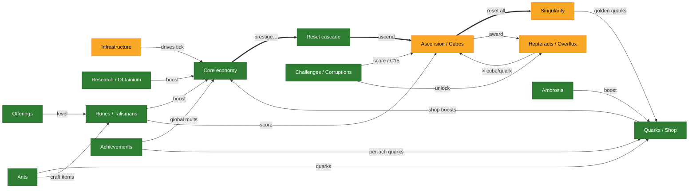

# Synergism — Systems Map

A map of how the original TypeScript *Synergism* game fits together, used as a reference for the
TS→Rust port. The single-canvas version was unreadable, so this is split into one focused, readable
page per domain. Each page has a small diagram, a "how it connects" note, a status-table slice, and
porting notes.

- **Nodes & edges** come from the frozen TS reference `legacy/original/src/` (chiefly `Calculate.ts`,
  `Reset.ts`, `Runes.ts`, `Cubes.ts`/`Platonic.ts`, `Hepteracts.ts`, `Achievements.ts`,
  `singularity.ts`). Key edges were spot-checked against source, not taken from memory.
- **Colors** = current Rust port status in `crates/synergismforkd_logic/src/…`, reconciled with the
  repo-root [`PARITY_AUDIT.md`](../../PARITY_AUDIT.md). **Snapshot: `main` @ 2026-06-08 (incl. PR #265) +
  branch `claude/nifty-colden-ef7278` (PR #269)** — the latter adds the `updateAll` autobuyers, the
  save export/import + on-load recompute (**H5 fixed**), and the achievement award groups.

## Legend

| Color | Status | Meaning |
|---|---|---|
| 🟩 green | **Ported** | substantially implemented and wired into the tick |
| 🟨 amber | **Partial** | implemented but with real gaps |
| 🟧 orange | **Stub** | scaffold / placeholder only, or paused by design |
| ⬜ grey | **Absent** | no meaningful Rust code |
| 🟨 + red ring | **⚠ open parity bug** | a confirmed HIGH audit finding (id labelled on the node) |
| ▫️ dashed | **external** | lives on another page; shown only to indicate a connection |

## The pages

| Page | Covers | Overall |
|---|---|---|
| [reset-cascade.md](reset-cascade.md) | the prestige → … → singularity reset spine; what each tier grants / resets / unlocks | 🟩 mostly |
| [core-economy.md](core-economy.md) | coins + the 4 building tiers, multipliers/accelerators, crystals, tax, research, obtainium | 🟩 |
| [ascension-cubes.md](ascension-cubes.md) | ascension score hub, the 4 cube tiers, opening + blessings + upgrades, hepteracts/overflux | 🟩 mostly |
| [runes-talismans.md](runes-talismans.md) | offerings, the 10 runes, blessings, spirits, talismans, fragments | 🟩 |
| [ants.md](ants.md) | ant producers / masteries / upgrades / sacrifice / crumbs / true-level | 🟩 |
| [challenges-corruptions.md](challenges-corruptions.md) | challenges 1–15, corruptions, campaign, constants, auto-challenge | 🟩 |
| [singularity-ambrosia.md](singularity-ambrosia.md) | singularity reset, golden quarks, octeracts, perks; ambrosia / blueberry / red-ambrosia | 🟩 mostly |
| [meta-economy.md](meta-economy.md) | quarks, shop, potions, purchases, codes, achievements, statistics/history | 🟩 mostly |
| [infrastructure.md](infrastructure.md) | game loop, calculate engine, state schema, events, save, UI, automation, RNG | 🟨 |

## Overview

Domain-level picture (each box links to its page above). Thick arrows = the reset/progression spine;
thin arrows = the main cross-domain flows.



## Open parity bugs

**None.** Every HIGH finding from the audit is now fixed in code, each verified against
`crates/synergismforkd_logic/`. Full audit detail in [`PARITY_AUDIT.md`](../../PARITY_AUDIT.md).

Fixed since the audit (shown green): **C1** global-speed mult, **C2** c10→ascension unlock,
**H6** cube-opening, **H7** ant-sacrifice; via PR #265 **P1.4** C15 accrual / **H3** rune
effective-level pipeline / **H4** rune-blessing power; via PR #269 **H5** (achievement points
recompute on load + every award group feeds the total); and now **H1** and **H2** — both already
fixed in code, the map had simply gone stale:

- **H1** — crystals / `prestige_shards` read *and* write the same `crystal_upgrades` slice; covered
  by the regression test `prestige_shards_accumulate_across_ticks` (`tick/mod.rs`).
- **H2** — a shared `true_ant_level()` wrapper (`tick/mod.rs:655`) threads the true level (free
  levels + extinction divisor) through every ant-production site, not just two.

> **Baseline caveat.** Reflects `main` *after* PR #265 + branch `claude/nifty-colden-ef7278`
> (PR #269), plus branch `claude/close-unmigrated-systems`: the quark multiplier
> (`calculateQuarkMultiplier`) + blueberry quark/free-levels are ported, the 21 `unlocks` keys are
> complete, **the singularity layer is live** (reset + GQ grant + seeded metadata), and **all 13
> `updateAll` autobuyer families are wired** (incl. talisman / tesseract / ant-upgrade). **No HIGH
> parity bugs remain open.** Branch `claude/wrap-meta-economy-quarks` additionally lands the
> campaign-token derivation, the exalt enter/exit loop, the elevator triad, and `preserveQuarks` —
> remaining non-UI work is host-tier seams and the parked backend; otherwise the UI tree.

## Appendix: full single-canvas map

The whole graph on one canvas lives in [`full-map.svg`](full-map.svg) — too dense to read at fit-width,
but fine if you open it and zoom. The per-domain pages above are the intended way to read this.

## Regenerating / validating the diagrams

The ` ```mermaid ` blocks render natively on GitHub. To syntax-check or render locally (no system
Chrome needed — `mmdc` downloads its own Chromium):

```bash
printf '{"args":["--no-sandbox"]}' > /tmp/pp.json
# validate every diagram in this folder:
for f in docs/systems/*.md; do
  npx -y @mermaid-js/mermaid-cli@latest -p /tmp/pp.json -i "$f" -o "/tmp/$(basename "$f").svg" || echo "FAILED: $f"
done
```
