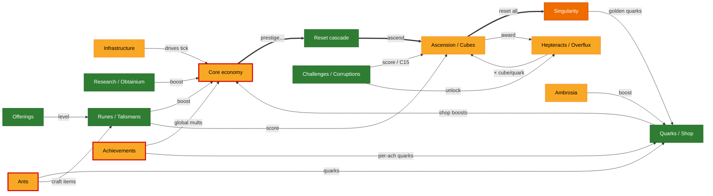

# Synergism — Systems Map

A map of how the original TypeScript *Synergism* game fits together, used as a reference for the
TS→Rust port. The single-canvas version was unreadable, so this is split into one focused, readable
page per domain. Each page has a small diagram, a "how it connects" note, a status-table slice, and
porting notes.

- **Nodes & edges** come from the frozen TS reference `legacy/original/src/` (chiefly `Calculate.ts`,
  `Reset.ts`, `Runes.ts`, `Cubes.ts`/`Platonic.ts`, `Hepteracts.ts`, `Achievements.ts`,
  `singularity.ts`). Key edges were spot-checked against source, not taken from memory.
- **Colors** = current Rust port status in `crates/synergismforkd_logic/src/…`, reconciled with the
  repo-root [`PARITY_AUDIT.md`](../../PARITY_AUDIT.md). **Snapshot: `main` @ 2026-06-08, including PR #265** (C15 accrual, achievement tail, rune-blessing wiring).

## Legend

| Color | Status | Meaning |
|---|---|---|
| 🟩 green | **Ported** | substantially implemented and wired into the tick |
| 🟨 amber | **Partial** | implemented but with real gaps |
| 🟧 orange | **Stub** | scaffold / placeholder only, or paused by design |
| ⬜ grey | **Absent** | no meaningful Rust code |
| 🟨 + red ring | **⚠ open parity bug** | a confirmed HIGH audit finding (id labelled on the node) |
| ▫️ dashed | **external** | lives on another page; shown only to indicate a connection |

## The pages

| Page | Covers | Overall |
|---|---|---|
| [reset-cascade.md](reset-cascade.md) | the prestige → … → singularity reset spine; what each tier grants / resets / unlocks | 🟩 mostly |
| [core-economy.md](core-economy.md) | coins + the 4 building tiers, multipliers/accelerators, crystals, tax, research, obtainium | 🟨 (H1) |
| [ascension-cubes.md](ascension-cubes.md) | ascension score hub, the 4 cube tiers, opening + blessings + upgrades, hepteracts/overflux | 🟨 |
| [runes-talismans.md](runes-talismans.md) | offerings, the 10 runes, blessings, spirits, talismans, fragments | 🟩 |
| [ants.md](ants.md) | ant producers / masteries / upgrades / sacrifice / crumbs / true-level | 🟩 (H2) |
| [challenges-corruptions.md](challenges-corruptions.md) | challenges 1–15, corruptions, campaign, constants, auto-challenge | 🟩 |
| [singularity-ambrosia.md](singularity-ambrosia.md) | singularity reset, golden quarks, octeracts, perks; ambrosia / blueberry / red-ambrosia | 🟧 / 🟨 |
| [meta-economy.md](meta-economy.md) | quarks, shop, potions, purchases, codes, achievements, statistics/history | 🟨 (H5) |
| [infrastructure.md](infrastructure.md) | game loop, calculate engine, state schema, events, save, UI, automation, RNG | 🟨 |

## Overview

Domain-level picture (each box links to its page above). Thick arrows = the reset/progression spine;
thin arrows = the main cross-domain flows.



## Open parity bugs (flagged on the pages)

HIGH findings still open on `main` — full detail in [`PARITY_AUDIT.md`](../../PARITY_AUDIT.md):

| Id | Where | One-liner |
|---|---|---|
| **H1** | [core-economy](core-economy.md) | crystals / `prestige_shards` read & write hit different slices → crystal coin-mult under-credited |
| **H2** | [ants](ants.md) | `calculate_true_ant_level` called at 2/~14 sites → free levels + extinction divisor still bypassed at most sites |
| **H5** | [meta-economy](meta-economy.md) | `compute_achievement_points` never called → crystal/mythos achievement exponents frozen ≈1.0 |

Fixed since the audit (shown green): **C1** global-speed mult, **C2** c10→ascension unlock,
**H6** cube-opening, **H7** ant-sacrifice, and — via PR #265 — **P1.4** C15 accrual,
**H3** rune effective-level pipeline, **H4** rune-blessing power.

> **Baseline caveat.** This reflects `main` *after* PR #265 merged. The earlier draft of this map was
> cut before #265 and flagged C15/H3/H4 as open; they're now wired, so those nodes are green here.
> Still-open: **H1**, **H2**, **H5**.

## Appendix: full single-canvas map

The whole graph on one canvas lives in [`full-map.svg`](full-map.svg) — too dense to read at fit-width,
but fine if you open it and zoom. The per-domain pages above are the intended way to read this.

## Regenerating / validating the diagrams

The ` ```mermaid ` blocks render natively on GitHub. To syntax-check or render locally (no system
Chrome needed — `mmdc` downloads its own Chromium):

```bash
printf '{"args":["--no-sandbox"]}' > /tmp/pp.json
# validate every diagram in this folder:
for f in docs/systems/*.md; do
  npx -y @mermaid-js/mermaid-cli@latest -p /tmp/pp.json -i "$f" -o "/tmp/$(basename "$f").svg" || echo "FAILED: $f"
done
```
