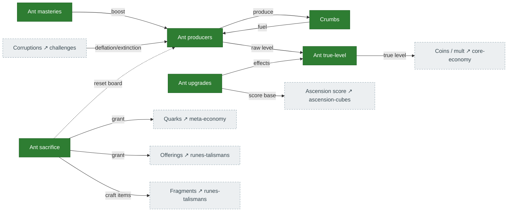

# Ants

A self-contained colony economy: **producers** generate **crumbs** (and ants), **masteries** and
**upgrades** scale them, and **sacrifice** cashes the colony in for quarks, offerings, obtainium, and
talisman craft items. A shared **true-level** calculation (raw level + free levels − extinction
divisor) is supposed to feed the many production effects. Source: `legacy/original/src/Features/Ants/`.

## Diagram

## How it connects

- **Out:** sacrifice is a primary **quark** source ([meta-economy](meta-economy.md)) and the source of
  talisman **craft items** ([runes-talismans](runes-talismans.md)); ant upgrades feed **ascension
  score**; true-level feeds coin/multiplier production.
- **In:** corruptions (deflation, extinction) modify ant production and the true-level divisor.

## Port status

| System | Status | Rust |
|---|---|---|
| Producers, masteries, upgrades, crumbs | 🟩 Ported | `mechanics/ant_producers.rs`, `ant_masteries.rs`, `ant_upgrades.rs`, `state/ants.rs` |
| Ant sacrifice | 🟩 Ported | `tick/mod.rs:5882`, `mechanics/ant_sacrifice.rs` (was audit **H7**) |
| Ant true-level | 🟩 Ported | shared `true_ant_level()` wrapper, `mechanics/ant_upgrade_levels.rs::calculate_true_ant_level` |

## Porting notes

- ✅ **H2 — true-level threaded (FIXED):** a shared `true_ant_level()` wrapper (`tick/mod.rs:655`)
  computes the free-level pool + extinction divisor (with the four `exemptFromCorruption` upgrades) and
  is called at **every** ant-production site — coin mult, multiplier mult, accelerator-boost mult,
  building power, tax reduction, ascension-score base, etc. The audit's "~2 of ~14" snapshot is stale.
- Two free-level *input* terms stay neutral-defaulted (identity at the default state): the
  `freeAntUpgrades` achievement reward (→ 0) and the challenge-15 `bonusAntLevel` multiplier (→ 1.0).
  These only diverge once those sources feed in; not a bypass. Wiring the now-ported achievement
  reward is a small follow-up.
- **Sacrifice** is wired and faithful (ELO, reborn-ELO, talisman tiers, offerings); some free-level
  inputs are neutral-defaulted pending the achievement/C15 sources that feed them.
