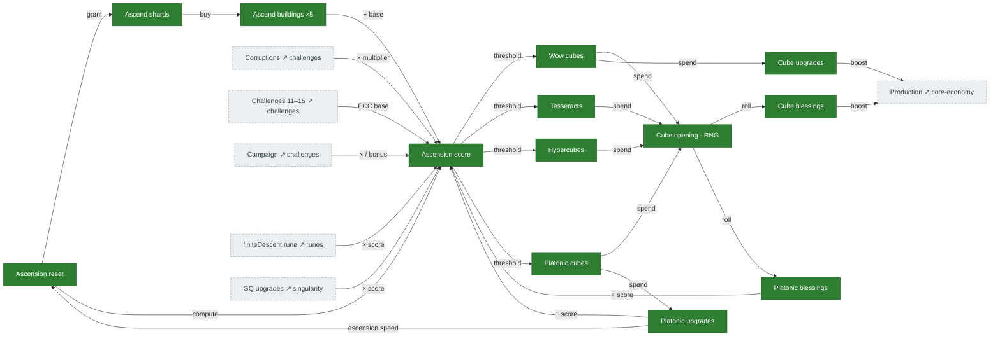
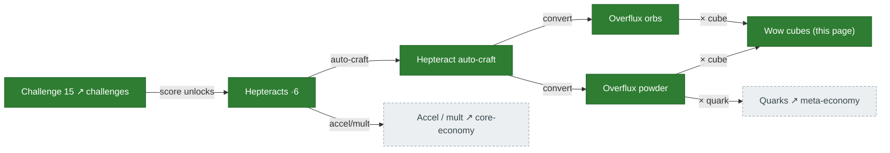

# Ascension & cubes

Ascension converts a run into an **ascension score**, which is the gate for the four cube tiers. Cubes
are opened for random **blessings** and spent on **cube/platonic upgrades** that boost the whole game.
Above a Challenge-15 threshold, score also yields **hepteracts**, which auto-craft into **overflux**
that loops back to boost cubes and quarks. Source: `Calculate.ts:1135-1294`
(`calculateAscensionScore`, `CalcCorruptionStuff`), `Cubes.ts`/`Platonic.ts`, `Hepteracts.ts`.

## Ascension score & the cube tiers

## Hepteracts & overflux

## How it connects

- **In:** corruptions, campaign, challenges 11–15, the finiteDescent rune, ant upgrades, and GQ
  upgrades all feed **ascension score**. C15 (on [challenges-corruptions](challenges-corruptions.md))
  unlocks hepteracts.
- **Out:** cube/platonic upgrades and blessings boost core production; overflux loops back into cubes
  and quarks.

## Port status

| System | Status | Rust |
|---|---|---|
| Ascension reset + award | 🟩 Ported | `tick/reset.rs:460-650` |
| Ascension score | 🟩 Ported | H2 fixed (routes `true_ant_level`); base arrays + c10 exponent + 1e23 softcap match TS |
| Cube tiers + opening (RNG) | 🟩 Ported | `mechanics/cube_opening.rs` (was audit **H6**) |
| Cube/platonic blessings + upgrades | 🟩 Ported | `cube_blessings.rs`, `platonic_blessings.rs`, `cube_upgrades.rs`, `platonic_upgrade_costs.rs` |
| Hepteracts | 🟩 Ported | `mechanics/hepteract_values.rs`, `hepteract_effects.rs` (DR softening on all 4 effects) |
| Overflux orbs / powder | 🟩 Ported | `mechanics/overflux_bonuses.rs` |

## Porting notes / open bugs

- **Cube opening** (audit **H6**) and **ascension reset/award** are done — this whole tree is largely
  faithful and is one of the more complete areas.
- ✅ **Hepteracts (DR softening done):** all 4 effects (chronos/hyperrealism/accelerator/multiplier)
  feed `hepteract_effective_bal()` (`tick/mod.rs:1283,1371,2140,2937`), applying the diminishing-returns
  softening past 1000 — matches TS `Hepteracts.ts`. Chronos uses the `platonicUpgrades[19]/750` DR
  increase.
- ✅ **Score — H2 fixed:** ascension score routes ant-upgrade index 14 through `true_ant_level()`
  like every other ant site (see [ants.md](ants.md)). c10→ascension unlock (audit **C2**) is also wired
  in production (`tick/mod.rs:5753`).
- Cube upgrades 4/5/6 regrant the just-cleared upgrade slots **on ascension reset**, matching TS
  `Reset.ts:739-751` (faithful port — the TS regrants at the same point, not on purchase).
