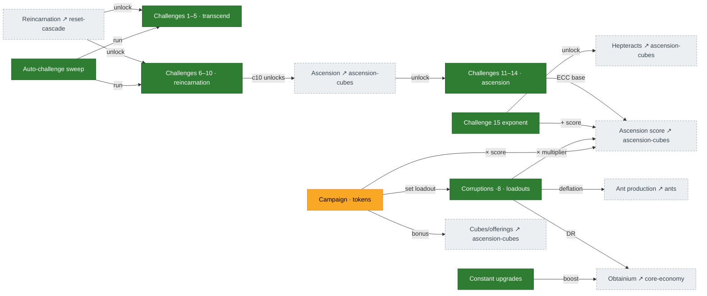

# Challenges, corruptions & campaign

Challenges are self-imposed restrictions that unlock features and (for 11–15) feed **ascension score**.
**Corruptions** are score-multiplying difficulty modifiers; **campaign** picks corruption loadouts and
grants bonus multipliers; **constant upgrades** are a small flat boost layer. Source: `Challenges.ts`,
`Corruptions.ts`, `Campaign.ts`, score arrays in `Calculate.ts:1174-1195`.

## Diagram

## How it connects

- **Out:** challenges 11–15 and corruptions are the dominant inputs to **ascension score**
  ([ascension-cubes](ascension-cubes.md)); C15 also unlocks hepteracts; the c10 completion is what
  unlocks ascension itself.
- **In:** reincarnation/ascension resets unlock the challenge ladders.

## Port status

| System | Status | Rust |
|---|---|---|
| Challenges 1–14 | 🟩 Ported | `mechanics/challenges.rs`, `tick/mod.rs:5186-5302` |
| Challenge 15 exponent | 🟩 Ported | `mechanics/challenge_15_rewards.rs`; accrual at `tick/mod.rs:5396` (PR #265) |
| Corruptions (8 effects) | 🟩 Ported | `state/corruptions.rs`, `mechanics/corruptions.rs` |
| Auto-challenge sweep | 🟩 Ported | `tick/challenge_sweep.rs` |
| Campaign / constant upgrades | 🟨 Partial | `state/campaigns.rs`, `mechanics/campaign_token_rewards.rs` |

## Porting notes / open bugs

- **P1.4 — C15 exponent accrual: fixed (PR #265).** The exponent is now written at `tick/mod.rs:5396`
  (commit `ff7683e9`), so the C15 reward cascade lights up and hepteracts are reachable via the C15
  path. (It was open at this map's first draft, cut before #265 merged.)
- Audit **C1** (global-speed mult dropped in c1) and **C2** (c10→ascension unlock dead) are **fixed**.
- **Campaign tokens:** the token count is never tracked, leaving ~14 dormant reward consumers at
  identity (UI-tier concern).
