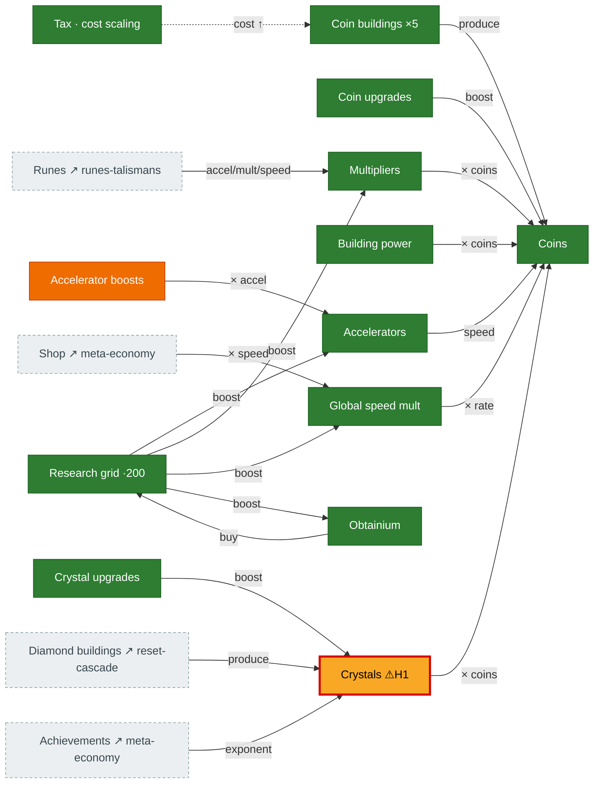

# Core economy

The deterministic production engine: four building tiers feed their currencies, and a stack of
multipliers/accelerators (plus crystals, research, and obtainium) scales coin output. Source:
`Synergism.ts` (`resourceGain`, the `produce*` chain, crystal multiplier at `Synergism.ts:2738`) and
`Calculate.ts`.

## Diagram

## How it connects

- **In:** diamond buildings (from [reset-cascade](reset-cascade.md)) produce **crystals**; **runes**,
  **achievements**, **cube/platonic upgrades**, and **shop** all feed multipliers here.
- **Out:** coins are the prestige trigger ([reset-cascade](reset-cascade.md)); obtainium also gates
  research, which boosts the multiplier stack and offerings.

## Port status

| System | Status | Rust |
|---|---|---|
| Coin/diamond/mythos/particle buildings + currencies | 🟩 Ported | `mechanics/coin_production.rs`, `producers.rs`, `particle_buildings.rs` |
| Coin/prestige/transcend/reincarnation upgrades | 🟩 Ported | `mechanics/upgrades.rs`, `state/upgrades.rs` |
| Crystals / `prestige_shards` | 🟨 Partial ⚠**H1** | `state/crystal_upgrades.rs`, `mechanics/resource_gain.rs` |
| Multipliers / accelerators | 🟩 Ported | `mechanics/multipliers.rs`, `accelerators.rs` |
| Accelerator boosts | 🟧 Stub | `mechanics/accelerator_boosts.rs` — cost ported, **no buy handler** → stays 0 |
| Global speed mult | 🟩 Ported | fixed in `tick/mod.rs:585` (was audit **C1**) |
| Research + Obtainium | 🟩 Ported | `mechanics/researches.rs`, `resource_gain.rs` |
| Building power / tax | 🟩 Ported | `mechanics/crystal_and_building_power.rs` |

## Porting notes / open bugs

- ⚠ **H1 — crystals desync:** `prestige_shards` is read from `crystal_upgrades.prestige_shards`
  (seeded right) but written to a different slice, so the crystal coin-multiplier is under-credited.
- **Accelerator boosts** are ported — `BuyRequest::AcceleratorBoost` runs the classic
  single-boost+prestige-reset path and the bulk solver, and the thrift rune-blessing
  `accelBoostCostDelay` now feeds the cost (the runes-page wire). The autobuyer path
  (`boostAccelerator(true)`) is now wired into the `updateAll` driver, and the `acceleratorBoosts`
  achievement group now awards.
- **`updateAll` autobuyers now self-drive** (PR #269, `tick/auto_buy.rs`, Phase 5): producers
  (coin/diamond/mythos/particle), accelerator/multiplier/boost, crystal upgrades, the upgrade tab,
  ascension constants, and ant producers/masteries — 10 of 13 families (ant-upgrades / talisman /
  tesseract deferred behind prerequisites). A pure-idle Rust loop auto-buys once the toggles are on.
