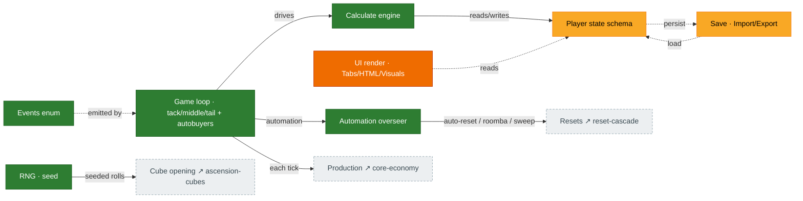

# Infrastructure

The cross-cutting tech that every gameplay system rides on: the **game loop** (tick), the **calculate
engine**, the central **state schema**, the **events** enum, **save**/import-export, the **UI** render
layer, the **automation** overseer, and the **RNG**. In Rust these map to the crate boundary
**UI → logic → bignum/common** (never the reverse). Source: `Synergism.ts`, `Calculate.ts`,
`UpdateHTML.ts`/`UpdateVisuals.ts`, `Tabs.ts`, `ImportExport.ts`, the `core_split/.../tick/` modules.

## Diagram

## Crate boundaries (Rust)

| Concern | Crate | Rule |
|---|---|---|
| Game loop, calc, state, events | `synergismforkd_logic` | no UI / wasm / fs / time-of-day / async |
| Big numbers | `synergismforkd_bignum` | thin `break-eternity-rs` wrapper; `Decimal` is `Copy` |
| Shared IDs / errors | `synergismforkd_common` | leaf dependency |
| Components | `synergismforkd_ui` | Dioxus only, platform-agnostic |
| Browser / desktop | `synergismforkd_ui_web` / `_desktop` | wasm / Tauri shells |
| Fixtures, sim runner | `synergismforkd_testkit` | dev-dependency only |

## Port status

| System | Status | Rust |
|---|---|---|
| Tick / game loop | 🟩 Mostly | `tick/mod.rs` + `tick/auto_buy.rs` (10/13 `updateAll` autobuyer families self-drive; ant-upgrades / talisman / tesseract deferred — each needs an unported prerequisite) |
| Calculate engine | 🟩 Ported | `mechanics/calculate.rs`, `math/*` (leaf math faithful; golden-vector coverage thin) |
| State schema | 🟨 Partial | `state/` (~80%; `unlocks` only 8/21 keys; some rune-blessing type divergence) |
| Events enum | 🟩 Ported | `events/mod.rs` |
| Save / Import-Export | 🟨 Partial | `crates/synergismforkd_save/` (postcard round-trip + versioned envelope + base64 export/import string + on-load achievement recompute; persistent storage + save-on-tick are host-tier) |
| UI render | 🟧 Stub | `synergismforkd_ui*` (scaffold) |
| Automation overseer | 🟩 Ported | `tick/auto_reset.rs`, `auto_research.rs`, `challenge_sweep.rs`, `automatic_tools.rs` |
| RNG | 🟩 Ported | deterministic Xoshiro, per-purpose seeding (used by cube opening) |

## Porting notes

- The **logic core is healthy**. The remaining infrastructure gaps are the **UI** tree (still
  scaffold), three deferred autobuyer families, and the host-tier slice of save (persistent storage,
  save-on-tick).
- The **`updateAll` autobuyers now self-drive** (`tick/auto_buy.rs`, run in Phase 5): autoUpgrades +
  coin/diamond/mythos/particle producers + accelerator/multiplier/boost + crystal upgrades + constant
  upgrades + ant producers/masteries. Deferred (dormant at default, each needs an unported
  prerequisite): the **ant-upgrade** autobuyer (16 per-upgrade `autobuy()` achievement-reward gates),
  the **talisman** autobuyer (`buyTalismanLevelToRarityIncrease` rarity-loop wrapper), and the
  **tesseract** autobuyer (`resetToggleModes.ascension` state + budget machinery). Inert on a fresh
  save (`player.toggles[1..=26]` default false).
- **Save-load** gained a base64 export/import string API and an on-load **achievement-points
  recompute** (the full 509-entry `ACHIEVEMENT_POINT_VALUES` table → closes audit **H5**). The Rust
  save format is fresh (no TS-save compat); persistent storage + save-on-tick stay host-tier.
- State schema is the gating dependency for several features: adding fields requires explicit sign-off
  (it affects save-file size) per the project rules.
