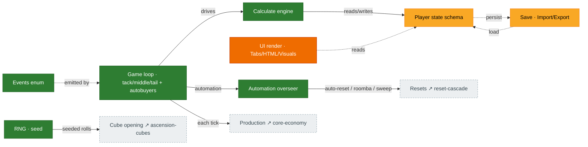

# Infrastructure

The cross-cutting tech that every gameplay system rides on: the **game loop** (tick), the **calculate
engine**, the central **state schema**, the **events** enum, **save**/import-export, the **UI** render
layer, the **automation** overseer, and the **RNG**. In Rust these map to the crate boundary
**UI → logic → bignum/common** (never the reverse). Source: `Synergism.ts`, `Calculate.ts`,
`UpdateHTML.ts`/`UpdateVisuals.ts`, `Tabs.ts`, `ImportExport.ts`, the `core_split/.../tick/` modules.

## Diagram

## Crate boundaries (Rust)

| Concern | Crate | Rule |
|---|---|---|
| Game loop, calc, state, events | `synergismforkd_logic` | no UI / wasm / fs / time-of-day / async |
| Big numbers | `synergismforkd_bignum` | thin `break-eternity-rs` wrapper; `Decimal` is `Copy` |
| Shared IDs / errors | `synergismforkd_common` | leaf dependency |
| Components | `synergismforkd_ui` | Dioxus only, platform-agnostic |
| Browser / desktop | `synergismforkd_ui_web` / `_desktop` | wasm / Tauri shells |
| Fixtures, sim runner | `synergismforkd_testkit` | dev-dependency only |

## Port status

| System | Status | Rust |
|---|---|---|
| Tick / game loop | 🟩 Ported | `tick/mod.rs` + `tick/auto_buy.rs` (all 13 `updateAll` autobuyer families self-drive) |
| Calculate engine | 🟩 Ported | `mechanics/calculate.rs`, `math/*` (leaf math faithful; golden-vector coverage thin) |
| State schema | 🟨 Partial | `state/` (~85%; `unlocks` 21/21 keys; + `total_quarks_ever`, `campaigns.current_campaign`; some rune-blessing type divergence) |
| Events enum | 🟩 Ported | `events/mod.rs` |
| Save / Import-Export | 🟩 Mostly | `crates/synergismforkd_save/` (postcard round-trip + versioned envelope + base64 export/import string + on-load achievement recompute + host-stamped `saved_at_ms`) **+ host wiring** (`ui_web::SaveHost`: localStorage + 5 s autosave loop + load-on-boot + export claim) — only offline-progress catch-up remains |
| UI render | 🟧 Stub | `synergismforkd_ui*` (scaffold; `ui_web` now also hosts the save seam) |
| Automation overseer | 🟩 Ported | `tick/auto_reset.rs`, `auto_research.rs`, `challenge_sweep.rs`, `automatic_tools.rs` |
| RNG | 🟩 Ported | deterministic Xoshiro, per-purpose seeding (used by cube opening) |

## Porting notes

- The **logic core is healthy**. The remaining infrastructure gap is the **UI** tree (still
  scaffold). The host-tier slice of save is now wired (`ui_web::SaveHost`); only offline-progress
  catch-up on a stale `saved_at_ms` is unported.
- ✅ **All 13 `updateAll` autobuyer families self-drive** (`tick/auto_buy.rs`, Phase 5): autoUpgrades +
  coin/diamond/mythos/particle producers + accelerator/multiplier/boost + crystal upgrades + constant
  upgrades + ant producers/masteries + the formerly-deferred three — **talisman** (Family 11,
  `buyTalismanLevelToRarityIncrease`), **tesseract** (Family 12, AMOUNT mode +
  `calculate_tess_buildings_in_budget`), and **ant-upgrades** (Family 13, per-upgrade
  achievement/research/milestone gates). Inert on a fresh save (`player.toggles[1..=26]` default
  false). The PERCENTAGE-mode tesseract path (on-ascension) is a separate, non-`updateAll` call site.
- **Save-load** gained a base64 export/import string API and an on-load **achievement-points
  recompute** (the full 509-entry `ACHIEVEMENT_POINT_VALUES` table → closes audit **H5**). The Rust
  save format is fresh (no TS-save compat).
- ✅ **Host-tier save wiring landed.** The envelope now carries a host-stamped `saved_at_ms` (the
  `offlinetick`/`lastExportedSave` analogue, kept off `GameState` so logic stays time-free) recovered
  via `load_with_meta` / `import_from_string_with_meta`. `ui_web::SaveHost<S: SaveStorage>` is the
  `Synergism.ts` save glue: load-on-boot (recomputing points; reports `Loaded{saved_at_ms}` / `Fresh`
  / `Corrupt`), a **5 s autosave loop** (`tick` accumulates game-time, matching
  `setNamedInterval('save', saveSynergy, 5000)`), `export` (claims `claim_export_rewards` then writes
  the blob — the `exportSynergism` happy path), `import`, and `reset`. Storage sits behind a
  `SaveStorage` trait so the orchestration is unit-tested on native; the `localStorage` backend +
  `Date.now` clock are wasm-gated (`web-sys`/`js-sys`). A corrupt blob boots fresh **without**
  clobbering the stored bytes. Remaining: offline-progress catch-up + the rAF cadence (Dioxus root).
- **Export-reward claim** (`synergismforkd_logic::claim_export_rewards`): the `goldenQuarksTimer` →
  golden-quarks and `quarkstimer` → worlds conversions (`ImportExport.ts:254-273`), previously absent
  so the timers accrued with nowhere to land. The host calls it on a real export, not the autosave.
- State schema is the gating dependency for several features: adding fields requires explicit sign-off
  (it affects save-file size) per the project rules. (`campaigns.current_campaign` was the one new
  state field this batch; the `saved_at_ms` timestamp lives on the save envelope, not `GameState`.)
