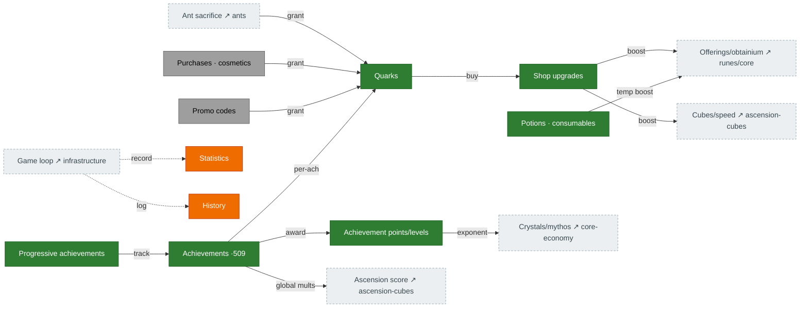

# Meta economy — quarks, shop & achievements

The persistent layer that survives resets. **Quarks** (from ant sacrifice, challenges, achievements,
purchases, codes) buy **shop upgrades** that broadly boost the game. **Achievements** award
**achievement points**, which drive crystal/mythos exponent multipliers and global bonuses. Source:
`Shop.ts`, `Quark.ts`, `Achievements.ts`, `Statistics.ts`/`History.ts`.

## Diagram

## How it connects

- **In:** quarks flow in from ant sacrifice, challenge completions, per-achievement rewards, purchases,
  and codes.
- **Out:** shop upgrades and achievement points are broad multipliers touching offerings, obtainium,
  cubes, global speed, crystals/mythos, and ascension score — they reach almost every other page.

## Port status

| System | Status | Rust |
|---|---|---|
| Quarks (gain + `calculateQuarkMultiplier`) | 🟩 Ported | `state/quarks.rs`, `mechanics/quarks.rs`, `compute_quark_multiplier` (tick) |
| Shop upgrades + costs | 🟩 Ported | `mechanics/shop_upgrades.rs`, `shop_costs.rs` |
| Potions / consumables | 🟩 Ported | `state/shop.rs` |
| Purchases / cosmetics / codes | ⬜ Absent | monetization + backend parked — see [`BACKEND_API_PLAN.md`](../../BACKEND_API_PLAN.md) |
| Achievements (509) | 🟩 Mostly | `state/achievements.rs`, `mechanics/achievement_*.rs` (all portable award groups done; remaining blocked — see notes) |
| Achievement points / levels | 🟩 Ported | `mechanics/achievement_points.rs` (H5 fixed: full-table recompute + every award group feeds the points total) |
| Statistics / History | 🟧 Stub | not yet modeled (UI-tier) |

## Porting notes / open bugs

- ✅ **H5 — FIXED.** The full-table recompute (`recompute_achievement_points` + the 509-entry
  `ACHIEVEMENT_POINT_VALUES`) now runs on save import, and **every portable award group** feeds the
  points total incrementally — so the crystal `(1+0.01·u)^points` / mythos `1.01^points·(points/5+1)`
  multipliers now grow with progress.
- ✅ **Award groups — all portable ones ported** (a per-tick monotonic sweep in `phase_global_state`,
  reusing `award_threshold_group`/`award_log10_group`): reset counts (ascension/prestige/transcend/
  reincarnation), accelerators/multipliers/acceleratorBoosts, speed-rune level/freeLevel/blessing/
  spirit, constant (ascendShards), antCrumbs, ascensionScore, **singularityCount** (indices 274–280,
  `highestSingularityCount` ≥ 1/2/3/4/5/7/10 — now reachable since the singularity layer is live),
  **campaignTokens** (indices 426–435, thresholds 10–9000 over the derived token total), and the
  ungrouped **thousandSuns/thousandMoons** (#250/#251, research-8x25 / cube-w5x10 maxed at 1e5) — on
  top of the pre-existing building / point-gain / challenge / sacrifice / no-reset groups.
- ✅ **Campaign tokens derived — every token bonus feeds.** `compute_campaign_tokens` ports
  `updateTokens()` as a pure derivation (no cached state): Σ per-campaign `computeTokenValue`
  (`campaign_token_rewards::campaign_token_value` over the 50-campaign limit/isMeta table —
  `CAMPAIGNS_LEN` was 10, a latent sizing bug) + `inheritance_tokens` (verbatim incl. the legacy
  loop quirk that dead-letters the level-2 tier) + the GQ/octeract bonus-token upgrades. All 14
  `campaign_token_rewards` formulas now feed from it: tax, ascension-score, octeract/s, quark,
  cube (tutorial + campaign), golden-quark, offering/obtainium pairs, the 3 reset-time-threshold
  reductions, ambrosia-luck, blueberry speed, and the c15 score multiplier. Tokens flow without
  the UI-tier campaign *runner* once `highestSingularityCount ≥ 5` (inheritance floor); the runner
  (picking campaigns, completing c10 under their corruptions) writes `campaign_completions` later.
- ✅ **Progressive achievements — all 12 slots live.** Slots 8–11 were the neutral tail: exalts
  (Σ `achievementPointValue(completions)` — a legacy getter, derivable from the tracked per-challenge
  counts), and the three maxed-upgrade families (`count_maxed_*` against the seeded GQ `max_level`
  metadata / new static `OCTERACT_MAX_LEVELS`/`RED_AMBROSIA_MAX_LEVELS` tables; ×5/×8/×10 points).
- ✅ **Quark multiplier ported — all reachable terms now wired.** `compute_quark_multiplier` assembles
  `allQuarkStats` (`Statistics.ts:1233`) and caches it into `quark_bonus` each tick as `(mult − 1)·100`
  — it was **never written** (always `0` ⇒ every quark gain credited at ×1). The three terms that were
  left neutral by the close-unmigrated push are now ported: `getAchievementReward('quarkGain')`
  (`achievement_rewards::quark_gain` — #250/#251 ×1.05, #266 ×(1+0.1·min(ascCount/1e15,1))), the
  Challenge-15 `quarks` reward (`challenge_15_rewards::quarks`, req 1e11), and the quark-hepteract bonus
  (gated on `challenge15Exponent ≥ 1e15`, the custom `(1+0.2·log2(1+bal/500))^(2+singQuarkHepteract1/2/3)`).
  The campaign bonus now also feeds (from the derived token total). Only **3 terms remain at
  identity**, all genuinely UI/external-blocked: `shopPanthema` / `infiniteAscent` (bonus-level
  precompute / shop unlock gate) and the host-tier event + patreon bonuses.
- **Still blocked** (genuinely UI/external): `addCodesUsed` (UI-tier code array; its 15 achievements
  are the only unported award group left), the campaign *runner* (UI-tier — token math is fully
  ported), and Statistics/History.
- **Shop: ~50 of 83 effects are wired** (chronometer→ascension-speed, season-pass→cube-mults,
  offering/obtainium EX + cashGrab, the cube-blessing/quark-from-opening paths, costs + potions — all
  done). The remaining ~33 are mostly **blocked or out of reachable scope**: the quark-conversion
  family (`cubeToQuark*`/`improveQuarkHept*` — these shop upgrades *amplify* the quark-hepteract craft;
  the quark-hepteract multiplier term itself is now wired, but these amplifiers await the hepteract
  crafting / cube-to-quark surface), the `calculator` family (UI add-codes), daily/powder/warp +
  `improved_daily` (host-tier daily reset), `shop_singularity_*`, `infinite_shop_upgrades` (unported
  shop-tablet sum).
  `constant_ex` is now wired. A few minor reachable wires remain (`challenge_tome` needs its
  research + c10-gating component; `obtainium_auto`).
- The **bonus-level composition** (effective shop level = raw `shopUpgrades[key]` + topHat-rune /
  ambrosia / red-ambrosia / singularity-challenge free levels) is unmodeled, but it's **late-game-only**
  (every free-level source needs singularity/ambrosia) and would route ~50 call sites — low current ROI.
