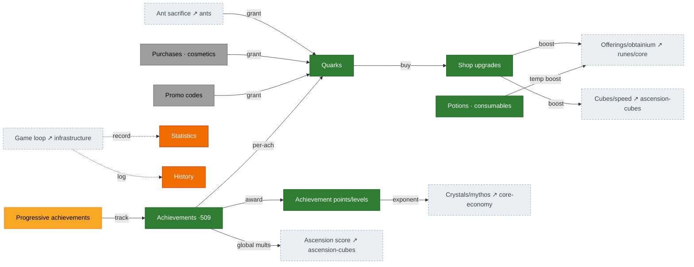

# Meta economy — quarks, shop & achievements

The persistent layer that survives resets. **Quarks** (from ant sacrifice, challenges, achievements,
purchases, codes) buy **shop upgrades** that broadly boost the game. **Achievements** award
**achievement points**, which drive crystal/mythos exponent multipliers and global bonuses. Source:
`Shop.ts`, `Quark.ts`, `Achievements.ts`, `Statistics.ts`/`History.ts`.

## Diagram

## How it connects

- **In:** quarks flow in from ant sacrifice, challenge completions, per-achievement rewards, purchases,
  and codes.
- **Out:** shop upgrades and achievement points are broad multipliers touching offerings, obtainium,
  cubes, global speed, crystals/mythos, and ascension score — they reach almost every other page.

## Port status

| System | Status | Rust |
|---|---|---|
| Quarks (incl. per-achievement reward) | 🟩 Ported | `state/quarks.rs`, `mechanics/quarks.rs` |
| Shop upgrades + costs | 🟩 Ported | `mechanics/shop_upgrades.rs`, `shop_costs.rs` |
| Potions / consumables | 🟩 Ported | `state/shop.rs` |
| Purchases / cosmetics / codes | ⬜ Absent | monetization + backend parked — see [`BACKEND_API_PLAN.md`](../../BACKEND_API_PLAN.md) |
| Achievements (509) | 🟩 Mostly | `state/achievements.rs`, `mechanics/achievement_*.rs` (all portable award groups done; remaining blocked — see notes) |
| Achievement points / levels | 🟩 Ported | `mechanics/achievement_points.rs` (H5 fixed: full-table recompute + every award group feeds the points total) |
| Statistics / History | 🟧 Stub | not yet modeled (UI-tier) |

## Porting notes / open bugs

- ✅ **H5 — FIXED.** The full-table recompute (`recompute_achievement_points` + the 509-entry
  `ACHIEVEMENT_POINT_VALUES`) now runs on save import, and **every portable award group** feeds the
  points total incrementally — so the crystal `(1+0.01·u)^points` / mythos `1.01^points·(points/5+1)`
  multipliers now grow with progress.
- ✅ **Award groups — all portable ones ported** (a per-tick monotonic sweep in `phase_global_state`,
  reusing `award_threshold_group`/`award_log10_group`): reset counts (ascension/prestige/transcend/
  reincarnation), accelerators/multipliers/acceleratorBoosts, speed-rune level/freeLevel/blessing/
  spirit, constant (ascendShards), antCrumbs, ascensionScore — on top of the pre-existing building /
  point-gain / challenge / sacrifice / no-reset groups.
- **Still blocked** (each needs an unported prerequisite): `campaignTokens` (the running token total
  isn't a Rust state field), `singularityCount` (singularity paused), `addCodesUsed` (UI-tier code
  array), progressive slots 8–11 (exalt rewardAP + upgrade `maxLevel` tracking unported). The
  `getAchievementReward('quarkGain')` reward-reader is blocked on the unported quark-multiplier
  assembler (`allQuarkStats` → `quark_bonus` is currently a static cache).
- Shop **bonus-level composition** + the ~76 ported-but-unwired shop effects are not yet modeled
  (the larger remaining meta-economy gap).
