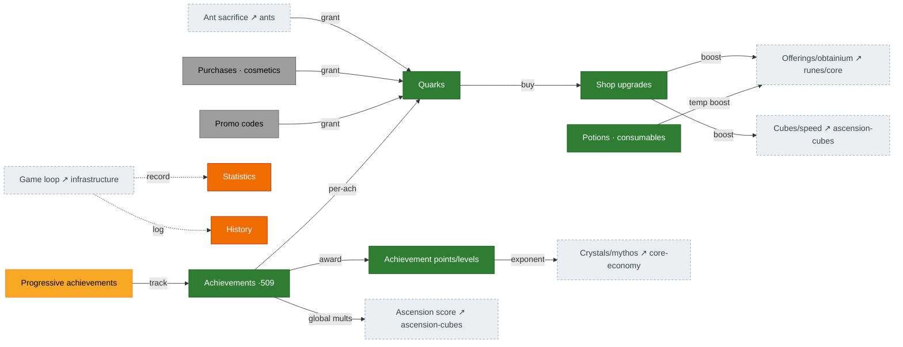

# Meta economy — quarks, shop & achievements

The persistent layer that survives resets. **Quarks** (from ant sacrifice, challenges, achievements,
purchases, codes) buy **shop upgrades** that broadly boost the game. **Achievements** award
**achievement points**, which drive crystal/mythos exponent multipliers and global bonuses. Source:
`Shop.ts`, `Quark.ts`, `Achievements.ts`, `Statistics.ts`/`History.ts`.

## Diagram

## How it connects

- **In:** quarks flow in from ant sacrifice, challenge completions, per-achievement rewards, purchases,
  and codes.
- **Out:** shop upgrades and achievement points are broad multipliers touching offerings, obtainium,
  cubes, global speed, crystals/mythos, and ascension score — they reach almost every other page.

## Port status

| System | Status | Rust |
|---|---|---|
| Quarks (gain + `calculateQuarkMultiplier`) | 🟩 Ported | `state/quarks.rs`, `mechanics/quarks.rs`, `compute_quark_multiplier` (tick) |
| Shop upgrades + costs | 🟩 Ported | `mechanics/shop_upgrades.rs`, `shop_costs.rs` |
| Potions / consumables | 🟩 Ported | `state/shop.rs` |
| Purchases / cosmetics / codes | ⬜ Absent | monetization + backend parked — see [`BACKEND_API_PLAN.md`](../../BACKEND_API_PLAN.md) |
| Achievements (509) | 🟩 Mostly | `state/achievements.rs`, `mechanics/achievement_*.rs` (all portable award groups done; remaining blocked — see notes) |
| Achievement points / levels | 🟩 Ported | `mechanics/achievement_points.rs` (H5 fixed: full-table recompute + every award group feeds the points total) |
| Statistics / History | 🟧 Stub | not yet modeled (UI-tier) |

## Porting notes / open bugs

- ✅ **H5 — FIXED.** The full-table recompute (`recompute_achievement_points` + the 509-entry
  `ACHIEVEMENT_POINT_VALUES`) now runs on save import, and **every portable award group** feeds the
  points total incrementally — so the crystal `(1+0.01·u)^points` / mythos `1.01^points·(points/5+1)`
  multipliers now grow with progress.
- ✅ **Award groups — all portable ones ported** (a per-tick monotonic sweep in `phase_global_state`,
  reusing `award_threshold_group`/`award_log10_group`): reset counts (ascension/prestige/transcend/
  reincarnation), accelerators/multipliers/acceleratorBoosts, speed-rune level/freeLevel/blessing/
  spirit, constant (ascendShards), antCrumbs, ascensionScore — on top of the pre-existing building /
  point-gain / challenge / sacrifice / no-reset groups.
- ✅ **Quark multiplier ported.** `compute_quark_multiplier` now assembles `allQuarkStats`
  (`Statistics.ts:1233`) and caches it into `quark_bonus` each tick as `(mult − 1)·100` — it was
  **never written** (always `0` ⇒ every quark gain credited at ×1). ~28 terms ported (achievements
  level, talisman, platonic, powder, singularity count, octeract bonuses, GQ packs, ambrosia incl. the
  blueberry quark upgrades, viscount, cash-grab, first-singularity); ~7 left at identity and documented
  (`quarkGain` achievement reward, c15 quark reward + quark-hepteract gate, shopPanthema, infiniteAscent,
  campaign, patreon).
- **Still blocked** (each needs an unported prerequisite): `campaignTokens` (the running token total
  isn't a Rust state field), `addCodesUsed` (UI-tier code array), progressive slots 8–11 (exalt
  rewardAP + upgrade `maxLevel` tracking unported). `singularityCount` now increments (the layer is
  live — see [singularity-ambrosia](singularity-ambrosia.md)), so its award group is unblocked; the
  `getAchievementReward('quarkGain')` term is the one quark-multiplier identity still pending a
  per-reward port.
- **Shop: ~50 of 83 effects are wired** (chronometer→ascension-speed, season-pass→cube-mults,
  offering/obtainium EX + cashGrab, the cube-blessing/quark-from-opening paths, costs + potions — all
  done). The remaining ~33 are mostly **blocked or out of reachable scope**: the quark-conversion
  family (`cubeToQuark*`/`improveQuarkHept*` feed the quark-hepteract term that
  `compute_quark_multiplier` still leaves neutral pending its c15 gate), the `calculator` family (UI
  add-codes), daily/powder/warp + `improved_daily` (host-tier daily reset), `shop_singularity_*`,
  `infinite_shop_upgrades` (unported shop-tablet sum).
  `constant_ex` is now wired. A few minor reachable wires remain (`challenge_tome` needs its
  research + c10-gating component; `obtainium_auto`).
- The **bonus-level composition** (effective shop level = raw `shopUpgrades[key]` + topHat-rune /
  ambrosia / red-ambrosia / singularity-challenge free levels) is unmodeled, but it's **late-game-only**
  (every free-level source needs singularity/ambrosia) and would route ~50 call sites — low current ROI.
