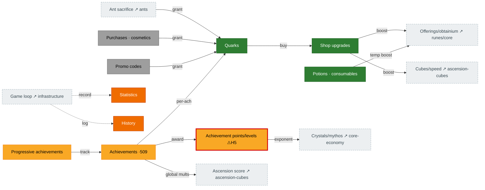

# Meta economy — quarks, shop & achievements

The persistent layer that survives resets. **Quarks** (from ant sacrifice, challenges, achievements,
purchases, codes) buy **shop upgrades** that broadly boost the game. **Achievements** award
**achievement points**, which drive crystal/mythos exponent multipliers and global bonuses. Source:
`Shop.ts`, `Quark.ts`, `Achievements.ts`, `Statistics.ts`/`History.ts`.

## Diagram

## How it connects

- **In:** quarks flow in from ant sacrifice, challenge completions, per-achievement rewards, purchases,
  and codes.
- **Out:** shop upgrades and achievement points are broad multipliers touching offerings, obtainium,
  cubes, global speed, crystals/mythos, and ascension score — they reach almost every other page.

## Port status

| System | Status | Rust |
|---|---|---|
| Quarks (incl. per-achievement reward) | 🟩 Ported | `state/quarks.rs`, `mechanics/quarks.rs` |
| Shop upgrades + costs | 🟩 Ported | `mechanics/shop_upgrades.rs`, `shop_costs.rs` |
| Potions / consumables | 🟩 Ported | `state/shop.rs` |
| Purchases / cosmetics / codes | ⬜ Absent | monetization + backend parked — see [`BACKEND_API_PLAN.md`](../../BACKEND_API_PLAN.md) |
| Achievements (509) | 🟨 Partial | `state/achievements.rs`, `mechanics/achievement_*.rs` |
| Achievement points / levels | 🟨 Partial ⚠**H5** | `mechanics/achievement_points.rs` |
| Statistics / History | 🟧 Stub | not yet modeled (UI-tier) |

## Porting notes / open bugs

- ⚠ **H5 — achievement points frozen:** `compute_achievement_points` still has **zero production
  callers**, so points stay at 0 and the crystal `(1+0.01·u)^points` and mythos `1.01^points·(points/5+1)`
  multipliers never leave ≈1.0 — a real mid-game coin-multiplier hole. PR #265 extended *awarding*
  (P3.1 slice 3b: no-reset + per-challenge achievements), but the points recompute (and the progressive
  cache update) is still missing.
- The achievement **full-table recompute** is blocked on save-load + the 509-entry value table.
- Shop **bonus-level composition** (topHat rune, ambrosia/red-ambrosia free nodes, etc. modifying shop
  rewards) is not yet modeled (medium finding).
