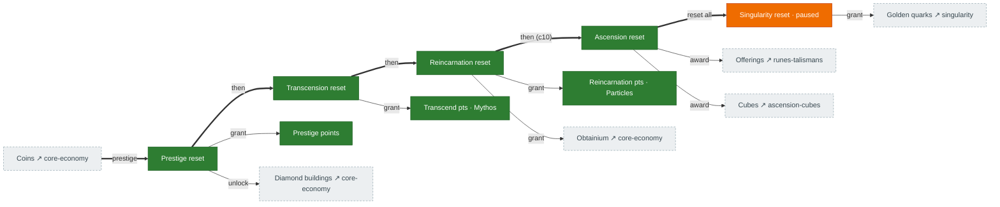

# Reset cascade

The backbone of the game: five stacked prestige layers. Each reset wipes the layers below it, grants a
new currency, and unlocks the next tier. Source: `legacy/original/src/Reset.ts` (`reset()`,
`singularity()`); grants confirmed at `Reset.ts:453/516/595` and the ascension award in
`CalcCorruptionStuff`.

## Diagram

Thick arrows = "then unlocks". Thin arrows = "grants". Dashed boxes live on other pages.

## What each tier resets vs. carries over

| Tier | Grants | Resets (wipes) | Unlocks / notes |
|---|---|---|---|
| **Prestige** | Prestige points | coins, coin buildings, coin upgrades | diamond buildings + the multiplier/accelerator economy |
| **Transcension** | Transcend points (Mythos) | the above + prestige layer | mythos buildings, crystals, challenges 1–5 |
| **Reincarnation** | Reincarnation points (Particles) | + transcension layer | particle buildings, obtainium, research, runes, ants, challenges 6–10 |
| **Ascension** | Wow cubes → platonic cubes, ascend shards, offerings | + reincarnation layer (coins…particles, runes, research) | ascend buildings, challenges 11–15, the whole cube tree |
| **Singularity** | Golden quarks | essentially everything except persistent shop/GQ unlocks | golden-quark + octeract + ambrosia trees. **Paused in Rust** |

## Port status

| Tier | Status | Rust |
|---|---|---|
| Prestige / Transcension / Reincarnation | 🟩 Ported | `tick/reset.rs:117-460` |
| Ascension (reset + `CalcCorruptionStuff` award) | 🟩 Ported | `tick/reset.rs:460-650` |
| Singularity | 🟧 Stub (paused) | `tick/mod.rs:5600+` — `singularity_count` never increments, so the whole layer is inert |

## Porting notes

- The reset cascade through **ascension is complete and faithful**, including the corruption-effects
  and extinction divisor used by the ascension award.
- **Singularity is paused by design**: golden-quark / octeract / perk machinery is ported but never
  fires because nothing increments `singularity_count`. See [singularity-ambrosia.md](singularity-ambrosia.md).
- Counts increment by a flat `+1` rather than `floor(multiplier)` (medium finding **P1.6**).
