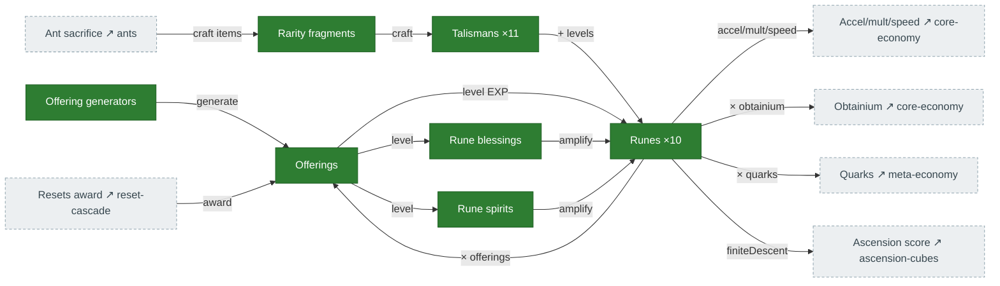

# Runes, talismans & offerings

**Offerings** are the fuel: spent to level the **runes**, their **blessings**, and their **spirits**.
**Talismans** (crafted from rarity **fragments**) add bonus rune levels. The runes then boost almost
everything — accelerators, multipliers, global speed, offerings/obtainium, quarks, and ascension
score. Source: `Runes.ts` (`getRuneEffects`, roster at `Runes.ts:24-30`), `Talismans.ts`,
`RuneBlessings.ts`, `RuneSpirits.ts`.

## Diagram

## The roster

Ten indexed runes (the current `Runes.ts` roster) — **speed, duplication, prism, thrift,
superiorIntellect, infiniteAscent, antiquities, horseShoe, finiteDescent, topHat**. The first five
carry blessings + spirits; the rest are late-game. Effects: speed → accelerator power + global speed;
duplication → multiplier boosts + tax reduction; prism → production + cost divisor; thrift → cost
delay + salvage; superiorIntellect → offerings + obtainium; infiniteAscent / antiquities → late-game
OOM bonuses; finiteDescent → ascension score.

## Port status

| System | Status | Rust |
|---|---|---|
| Offerings | 🟩 Ported | `mechanics/resource_gain.rs` (awarded on every reset tier) |
| Runes | 🟩 Ported | `state/runes.rs`, `mechanics/rune_*.rs` — effective-level pipeline now wired (was H3) |
| Rune blessings | 🟩 Ported | `mechanics/rune_blessing_effects.rs` — fed `rune_blessing_power(…)` (was H4) |
| Rune spirits | 🟩 Ported | `mechanics/rune_spirit_effects.rs` — all 5 fed `rune_spirit_power(…)`; inert until spirit levels exist (late-game) |
| Talismans + fragments | 🟩 Ported | `state/talismans.rs`, `mechanics/talisman_*.rs` — rarity recompute + talisman→rune-level bonus live |

## Porting notes / open bugs

- **H3 — effective-level pipeline: fixed (PR #265).** Rune effects now read
  `first_five_effective_rune_level = (raw + free) × effectiveness_mult` (`tick/mod.rs:824`), and
  `infiniteAscent` is present in the roster. (This was the map's most prominent bug in the first draft,
  cut before #265.)
- **H4 — blessing power: fixed (PR #265).** Blessing effects are now fed `rune_blessing_power(state, …)`
  rather than the raw level, so they scale instead of pinning near 1.0×.
- **Schema grown to the current roster.** State is now 10 runes / 11 talismans (was 7 / 7), matching
  `Runes.ts` / `Talismans.ts`. Both reset paths (`reset.rs`) are tier-faithful: an ascension keeps the
  singularity/never-tier runes (infiniteAscent, antiquities, horseShoe, topHat) and talismans
  (achievement, cookieGrandma, horseShoe).
- **Rune spirits — ported.** `rune_spirit_power(state, rune) = spirit.level · rune.level · blessing.level
  · otherSpiritMultipliers` (the `spiritMultiplier` chain, mirroring `rune_blessing_power`) now feeds all
  five spirit effects (speed/duplication/prism/thrift/SI). Inert at reachable play (spirit levels need
  late-game unlocks); challenge-15 `spiritBonus` + corruption difficulty mult are neutral 1.0.
- **Talismans — ported.** Per-tick `recompute_talisman_rarities` drives `talisman_rarity` from level +
  unlock, lighting the rarity-indexed effects (was frozen 0); `get_rune_bonus_from_all_talismans` ports
  the talisman→rune-level bonus (11×10 coefficient table + stat-sum + metaphysics/mortuus amplifiers).
  Residual neutral-defaults: the chronos/midas/metaphysics/polymath/achievement/horseShoe **unlock gates**
  read unported subsystems (achievement rewards, level milestones, singularity) → those stay locked, so
  the metaphysics amplifier is unreachable until its gate ports; the prism/thrift/SI per-rune coin/upgrade
  free-level aggregators are still unported (only their talisman-bonus term is live). The deprecated
  per-rune `rune_assignments` slots are documented dead state.
- **Thrift blessing** remains the one carve-out — blocked on the accelerator-boost (`boostAccelerator`)
  buy (see [core-economy.md](core-economy.md)). Its effect (`accelBoostCostDelay`) is a 1-line wire once
  that buy lands.
