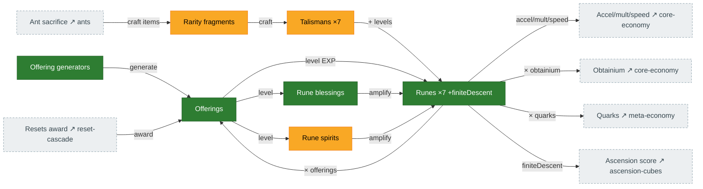

# Runes, talismans & offerings

**Offerings** are the fuel: spent to level the **runes**, their **blessings**, and their **spirits**.
**Talismans** (crafted from rarity **fragments**) add bonus rune levels. The runes then boost almost
everything — accelerators, multipliers, global speed, offerings/obtainium, quarks, and ascension
score. Source: `Runes.ts` (`getRuneEffects`, roster at `Runes.ts:24-30`), `Talismans.ts`,
`RuneBlessings.ts`, `RuneSpirits.ts`.

## Diagram

## The roster

Seven indexed runes — **speed, duplication, prism, thrift, superiorIntellect, infiniteAscent,
antiquities** — plus a special **finiteDescent** (ascension-score). Effects (per `Runes.ts`): speed →
accelerator power + global speed; duplication → multiplier boosts + tax reduction; prism → production
+ cost divisor; thrift → cost delay + salvage; superiorIntellect → offerings + obtainium;
infiniteAscent / antiquities → late-game OOM bonuses; finiteDescent → ascension score.

## Port status

| System | Status | Rust |
|---|---|---|
| Offerings | 🟩 Ported | `mechanics/resource_gain.rs` (awarded on every reset tier) |
| Runes | 🟩 Ported | `state/runes.rs`, `mechanics/rune_*.rs` — effective-level pipeline now wired (was H3) |
| Rune blessings | 🟩 Ported | `mechanics/rune_blessing_effects.rs` — fed `rune_blessing_power(…)` (was H4) |
| Rune spirits | 🟨 Partial | `mechanics/rune_spirit_effects.rs` (several inert at default) |
| Talismans + fragments | 🟨 Partial | `state/talismans.rs`, `mechanics/talisman_*.rs` |

## Porting notes / open bugs

- **H3 — effective-level pipeline: fixed (PR #265).** Rune effects now read
  `first_five_effective_rune_level = (raw + free) × effectiveness_mult` (`tick/mod.rs:824`), and
  `infiniteAscent` is present in the roster. (This was the map's most prominent bug in the first draft,
  cut before #265.)
- **H4 — blessing power: fixed (PR #265).** Blessing effects are now fed `rune_blessing_power(state, …)`
  rather than the raw level, so they scale instead of pinning near 1.0×.
- **Talismans (still partial):** rarity is never recomputed → stays 0, which zeroes all rarity-indexed
  effects. Rune assignment still maps the legacy-deprecated schema.
- **Thrift blessing** is blocked on the accelerator-boost buy (see [core-economy.md](core-economy.md)).
