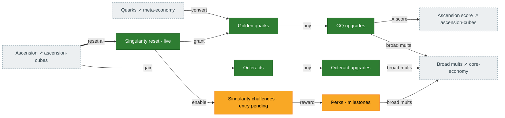
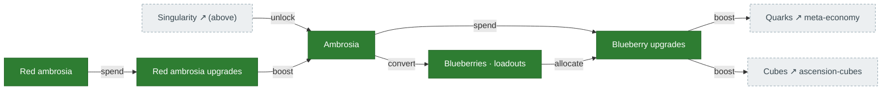

# Singularity & ambrosia

The meta-layer above ascension. **Singularity** resets everything for **golden quarks**, which buy
golden-quark and **octeract** upgrades plus **perks**. **Ambrosia** (and its sibling **red ambrosia**)
is a parallel idle currency spent on **blueberry** upgrades. Source: `singularity.ts`,
`SingularityChallenges.ts`, `Octeracts.ts`, `BlueberryUpgrades.ts`, `RedAmbrosiaUpgrades.ts`.

> **The layer is now LIVE.** `perform_singularity_reset` (`tick/reset.rs`) increments
> `singularity_count`, grants golden quarks (`calculateGoldenQuarks`), and rebuilds the player from a
> blank save preserving meta-progression — triggered by `ResetRequest::Singularity` (gated on the
> antiquities rune). The 80-entry GQ-upgrade metadata is seeded, so costs are real. Deferred: the
> elevator triad (auto-climb only) and singularity-challenge *entry* (the challenge state + jump path
> exist via `SingularityChallenge`, but auto/UI entry is unwired).

## Singularity

## Ambrosia / blueberry / red ambrosia

## Port status

| System | Status | Rust |
|---|---|---|
| Singularity reset / layer | 🟩 Ported (live) | `tick/reset.rs::perform_singularity_reset`, `calculate_golden_quarks` |
| Golden quarks + GQ upgrades | 🟩 Ported | `state/golden_quarks.rs` (80-entry metadata seeded), `mechanics/golden_quark_upgrades.rs` |
| Octeracts + upgrades | 🟩 Ported | `state/octeract_upgrades.rs`, `mechanics/octeracts.rs` |
| Singularity challenges / perks | 🟨 Partial | machinery + `SingularityChallenge` jump ported; auto/UI *entry* unwired |
| Ambrosia | 🟩 Ported | `state/ambrosia.rs`, `mechanics/ambrosia.rs` |
| Blueberry upgrades | 🟩 Ported | `mechanics/blueberry_upgrades.rs`; effective levels populated (`populate_ambrosia_free_levels`), quark upgrades wired |
| Red ambrosia + upgrades | 🟩 Ported | `state/red_ambrosia.rs`, `mechanics/red_ambrosia_*.rs` |

## Porting notes

- ✅ **Revived.** `perform_singularity_reset` (`Reset.ts:1063-1285`) is the blankSave reconstruction:
  reset to `GameState::default()` (== `reset_save`), restore the meta-progression survivors
  (achievements, GQ balance + grant + all 80 upgrades + `total_quarks_ever`, octeract / ambrosia-upgrade
  / red-ambrosia trees, shop, singularity challenge state + counts, automation prefs, RNG/level,
  never-tier rune/talismans, ant high-water marks, `cubeUpgrades[80]`, and the prestige/transcend/
  reincarnation counts once highest ≥ 8). Count auto-climbs `max(highest, count + lookahead)`.
- ✅ **GQ metadata seeded** (`GQ_UPGRADE_SEEDS`, 80 rows) — `cost_per_level` / `max_level` / cost-form
  now real, closing the free-unlimited-level hazard.
- **Deferred:** the elevator triad (locked/slow-climb/target — auto-climb is faithful for fresh saves);
  singularity-challenge auto/UI entry; `worlds` (quarks) reset has no `preserveQuarks` branch yet
  (inert until that challenge is entered).
