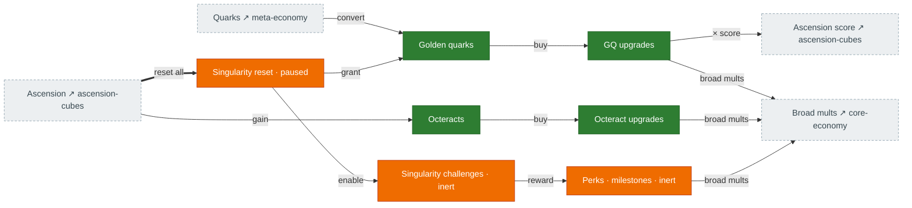
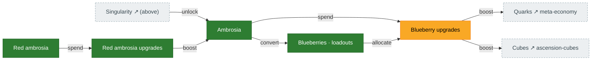

# Singularity & ambrosia

The meta-layer above ascension. **Singularity** resets everything for **golden quarks**, which buy
golden-quark and **octeract** upgrades plus **perks**. **Ambrosia** (and its sibling **red ambrosia**)
is a parallel idle currency spent on **blueberry** upgrades. Source: `singularity.ts`,
`SingularityChallenges.ts`, `Octeracts.ts`, `BlueberryUpgrades.ts`, `RedAmbrosiaUpgrades.ts`.

> **Whole layer is paused in Rust.** The pieces are ported but `singularity_count` never increments,
> so nothing here actually fires yet. Colors reflect that: machinery 🟩/🟨 but the layer is 🟧 inert.

## Singularity

## Ambrosia / blueberry / red ambrosia

## Port status

| System | Status | Rust |
|---|---|---|
| Singularity reset / layer | 🟧 Stub (paused) | `state/singularity.rs`, `tick/mod.rs:5600+` |
| Golden quarks + GQ upgrades | 🟩 Ported (inert) | `state/golden_quarks.rs`, `mechanics/golden_quark_upgrades.rs` |
| Octeracts + upgrades | 🟩 Ported (inert) | `state/octeract_upgrades.rs`, `mechanics/octeracts.rs` |
| Singularity challenges / perks | 🟧 Stub | ported but never entered/triggered |
| Ambrosia | 🟩 Ported | `state/ambrosia.rs`, `mechanics/ambrosia.rs` |
| Blueberry upgrades | 🟨 Partial | `mechanics/blueberry_upgrades.rs` — `effective_levels` deferred to caller |
| Red ambrosia + upgrades | 🟩 Ported | `state/red_ambrosia.rs`, `mechanics/red_ambrosia_*.rs` |

## Porting notes

- This layer is **parked**, not broken: golden-quark / octeract / perk / challenge machinery is ported
  but every reward is frozen at identity because the count never moves. Reviving it needs a production
  path that increments `singularity_count`.
- GQ per-slot metadata is zeroed at default (`cost_per_level=0`, `max_level=0`) — a free-unlimited-level
  hazard if an unseeded buy ever runs (medium finding).
- A few singularity reward fns have zero production callers (`no_quark_upgrades_effect`,
  `sadistic_prequel`, `taxman_last_stand`).
